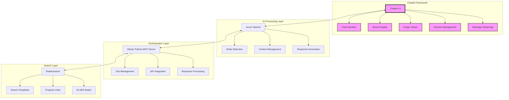
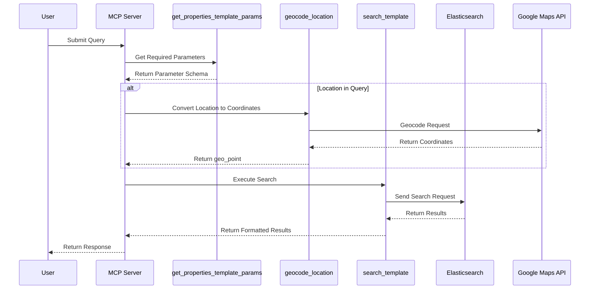

# Building an AI-Powered Property Search System with Azure OpenAI and Elasticsearch

## Introduction

In today's digital age, finding the perfect property can be overwhelming due to the vast amount of available options and complex search criteria. This article explores an innovative solution that combines Azure OpenAI's natural language processing capabilities with Elasticsearch's powerful search engine to create an intelligent property search system.

## System Architecture and Component Roles

### 1. Chainlit UI Layer
- Provides the interactive chat interface
- Handles real-time message streaming
- Manages user session state
- Displays property results and images
- Enables conversational interaction

### 2. Azure OpenAI for Entity Detection
- Processes natural language queries
- Extracts search attributes and entities
- Maintains conversation context
- Validates and normalizes search parameters
- Handles implicit requirements

### 3. Elasticsearch Search Templates
- Define query structures for different search scenarios
- Map detected entities to search parameters
- Generate dynamic Elasticsearch queries
- Handle complex boolean logic
- Support geo-spatial queries

### 4. Elastic Python MCP Server
- Orchestrates communication between components
- Manages tool calls and responses
- Handles API integrations
- Processes search results
- Formats responses for the UI

## System Architecture Diagram

### High-Level Architecture



### Data Flow Architecture



## The Problem: Complex Property Search Requirements

### Traditional Search Limitations

Traditional property search systems face several challenges:

1. **Rigid Search Parameters**
   - Users must adapt to predefined search fields
   - Limited ability to express complex requirements
   - No support for natural language queries
   - Difficulty in combining multiple criteria

2. **Entity Recognition Challenges**
   - Manual mapping of user requirements to search parameters
   - Inability to understand contextual information
   - Difficulty in handling implicit requirements
   - Limited support for synonyms and related terms

3. **Query Generation Complexity**
   - Static search templates
   - Limited flexibility in combining search criteria
   - Difficulty in handling complex boolean logic
   - Inability to adapt to user's natural language patterns

## Real-World Example: Complex Property Search

Let's walk through how the system processes the query: "Find me a home within 10 miles of Surfside Beach, Texas with a pool and up to $300,000"

### 1. Natural Language Processing

The LLM first breaks down the query into key entities:

```json
{
    "property_type": "home",
    "location": {
        "city": "Surfside Beach",
        "state": "Texas",
        "radius": "10 miles"
    },
    "amenities": ["pool"],
    "price": {
        "max": 300000,
        "currency": "USD"
    }
}
```

### 2. Entity Detection and Mapping

The system uses Azure OpenAI to identify and validate these entities:

1. **Location Validation**
   - Confirms Surfside Beach, Texas exists
   - Converts "10 miles" to a searchable radius
   - Maps to Elasticsearch geo-point coordinates

2. **Property Requirements**
   - Identifies "home" as the property type
   - Validates pool as a searchable amenity
   - Converts price to a numeric range

### 3. Dynamic Query Generation

The system generates an Elasticsearch query that combines:

```json
{
    "query": {
        "bool": {
            "must": [
                {
                    "geo_distance": {
                        "distance": "10mi",
                        "location": {
                            "lat": 28.9444,
                            "lon": -95.2894
                        }
                    }
                },
                {
                    "term": {
                        "property_type": "home"
                    }
                },
                {
                    "term": {
                        "amenities": "pool"
                    }
                },
                {
                    "range": {
                        "price": {
                            "lte": 300000
                        }
                    }
                }
            ]
        }
    }
}
```

## Technical Implementation

### Backend Components

1. **Azure OpenAI Integration**
```python
class ChatClient:
    def __init__(self) -> None:
        self.client = AsyncAzureOpenAI(
            azure_endpoint=os.environ["AZURE_OPENAI_ENDPOINT"],
            api_key=os.environ["AZURE_OPENAI_API_KEY"],
            api_version=os.environ["OPENAI_API_VERSION"]
        )
```

2. **Elasticsearch Integration**
- Custom search templates for property queries
- ELSER inference endpoint configuration
- Property index with optimized mappings

### Frontend Interface

The Chainlit-based interface provides:
- Real-time chat interaction
- Property image display
- Search result visualization
- Interactive filtering options

## Setup and Configuration

1. **Prerequisites**
   - Python 3.8 or higher
   - Azure OpenAI API access
   - Elasticsearch Serverless instance
   - Microsoft Copilot Plugins (MCP) tools

2. **Environment Setup**
   - Configure Azure OpenAI credentials
   - Set up Elasticsearch instance
   - Initialize the ELSER inference endpoint
   - Create property index and search templates

3. **Data Preparation**
   - Property data ingestion
   - Search template configuration
   - Index optimization

## Best Practices

1. **Security**
   - Secure API key management
   - Environment variable protection
   - Rate limiting implementation

2. **Performance**
   - Stream processing for real-time responses
   - Efficient resource cleanup
   - Error handling and recovery

3. **User Experience**
   - Natural language understanding
   - Contextual responses
   - Interactive refinement options

## Future Enhancements

1. **Advanced Features**
   - Property recommendation engine
   - Market trend analysis
   - Virtual property tours

2. **Integration Possibilities**
   - CRM system integration
   - Payment processing
   - Document management

## Conclusion

This AI-powered property search system demonstrates the power of combining Azure OpenAI's natural language processing with Elasticsearch's search capabilities. The solution provides an intuitive and efficient way for users to find their ideal properties through natural conversation, making the property search process more accessible and user-friendly.

## Resources

- [Azure OpenAI Chat Client Repository](https://github.com/sunilemanjee/Elastic_Azure_OpenAI_MCP/tree/main/mcp_aoai)
- [Elastic-Python-MCP-Server Repository](https://github.com/sunilemanjee/Elastic-Python-MCP-Server)
- [Setup Guide and Documentation](https://github.com/sunilemanjee/Elastic_Azure_OpenAI_MCP/tree/main/mcp_aoai#readme) 